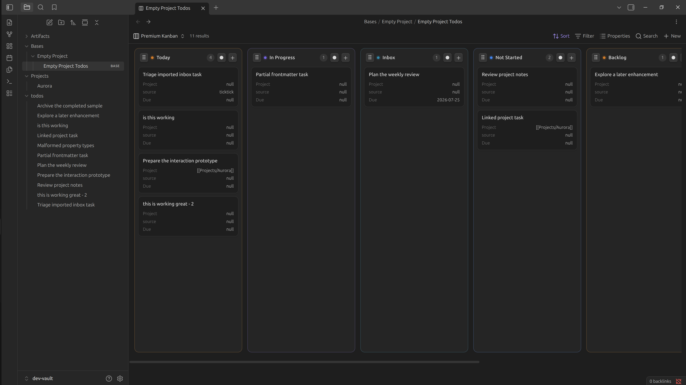

# Premium Kanban

[](https://github.com/VinayakRamavath/obsidian-premium-kanban-plugin/actions/workflows/ci.yml)
[](https://github.com/VinayakRamavath/obsidian-premium-kanban-plugin/releases)
[](LICENSE)

Premium Kanban is an Obsidian community plugin prototype that renders Obsidian Bases results
as a polished, task-focused Kanban board. Markdown files and frontmatter remain the source of
truth.



> [!WARNING]
> Premium Kanban is a public alpha that writes task Status values and per-view configuration.
> Test it with a copied or backed-up vault before relying on it for daily work.

This repository currently implements the interaction-quality proof only:

- Registers the custom Bases view type `premium-kanban`.
- Uses the Base's filters, grouping, property order, sorting, and `columnOrder`.
- Renders filename-based task cards with the selected Base properties.
- Moves cards between Status columns with pointer, trackpad, basic touch, and keyboard sensors.
- Uses dnd-kit for drag geometry and GSAP Flip for card displacement and rollback motion.
- Creates tasks directly in a Status column using the Base's file-creation rules.
- Adds empty Status columns and reorders columns with a dedicated drag handle.
- Keeps cards in the order produced by the Base's configured sort.
- Provides configurable Status-column accents.
- Updates only the `Status` frontmatter key through `FileManager.processFrontMatter()`.
- Optimistically updates the board, serializes writes per file, and rolls back failed writes.
- Reconciles edits, renames, deletions, and other vault changes through `BasesView.onDataUpdated()`.

No task database, sync service, frontmatter rank property, drawer, advanced filtering, or AI feature is
included.

## Install

### BRAT

[BRAT](https://github.com/TfTHacker/obsidian42-brat) is the simplest way to install and update the
public alpha:

1. Install and enable **BRAT** in Obsidian.
2. Run **BRAT: Add a beta plugin for testing** from the command palette.
3. Enter
   `https://github.com/VinayakRamavath/obsidian-premium-kanban-plugin`.
4. Enable **Premium Kanban** under **Settings → Community plugins**.

### Manual installation

1. Open the
   [latest GitHub release](https://github.com/VinayakRamavath/obsidian-premium-kanban-plugin/releases/latest).
2. Download `main.js`, `manifest.json`, and `styles.css`.
3. Create `<vault>/.obsidian/plugins/premium-kanban/`.
4. Copy the three downloaded files into that directory.
5. Reload Obsidian and enable **Premium Kanban** under **Settings → Community plugins**.

The plugin requires Obsidian 1.10.0 or newer with the Bases core plugin enabled.

## Configure a Base

Open a `.base` file, add or select a view, and choose **Premium Kanban** as its layout. Configure
**Group by → Status**. `columnOrder` may be a comma-separated string such as:

```yaml
columnOrder: Today,In Progress,Inbox,Not Started,Backlog,Completed
```

The development vault includes a working example at
`Bases/Empty Project/Empty Project Todos.base`.

## Develop from source

```bash
git clone https://github.com/VinayakRamavath/obsidian-premium-kanban-plugin.git
cd obsidian-premium-kanban-plugin
npm install
npm run dev:setup
npm run dev
```

Then:

1. Open the repository's `dev-vault/` folder as a vault in Obsidian.
2. Open **Settings → Community plugins**, turn off Restricted mode if prompted, and enable
   **Premium Kanban**.
3. Make sure the **Bases** core plugin is enabled.
4. Open `Bases/Empty Project/Empty Project Todos.base`.
5. Select **Premium Kanban** from the Base view-layout menu.

After a rebuild, use Obsidian's **Reload app without saving** command or disable and re-enable the
plugin to load the latest JavaScript. Installing the optional Hot Reload plugin removes this
manual reload step during development.

## Requirements

- Obsidian 1.10.0 or newer with the Bases core plugin enabled
- Node.js 20 or newer for development
- npm

## Development vault

The repository contains a disposable vault at `dev-vault/`. Its task titles, links, external IDs,
and body content are synthetic. It includes all supported Status values, empty and linked Project
values, TickTick metadata, agent metadata, incomplete frontmatter, and deliberately unexpected
property types.

Set up the plugin link and build it:

```bash
npm install
npm run dev:setup
npm run dev
```

Open `dev-vault/` in Obsidian, enable community plugins, and enable **Premium Kanban**. Open
`Bases/Empty Project/Empty Project Todos.base` and select the **Premium Kanban** view.

For automatic reloads, install and enable
[pjeby/hot-reload](https://github.com/pjeby/hot-reload) in the development vault. The setup command
links the repository into `.obsidian/plugins/premium-kanban`, so changes to `main.js` or
`styles.css` reload immediately.

Generate an untracked synthetic load-test set when profiling:

```bash
npm run fixtures:load -- --count 500
```

The generated files are placed under `dev-vault/todos/__load-test/`.

## Build and test

```bash
npm run lint
npm run format:check
npm test
npx playwright install chromium
npm run test:interaction
npm run build
```

`npm run build` type-checks the project, creates a minified `main.js`, and verifies the three
Obsidian release artifacts:

- `main.js`
- `manifest.json`
- `styles.css`

The Playwright harness uses the production React board, dnd-kit sensors, GSAP animation code, and
a controlled fake mutation service. It verifies pointer dragging, optimistic placement,
successful reconciliation, and animated failure rollback without needing to automate Obsidian
itself.

## Data-safety behavior

The public Bases API supplies grouped results but does not expose a typed group-property getter.
Before enabling dragging, the adapter checks every `note.*` property against every returned group.
Mutation is enabled only when exactly one property reproduces the grouping and that property is
`note.Status`. An ambiguous or unsupported grouping remains visible but read-only.

Dropping a card:

1. Updates the board immediately.
2. Queues a Status-only frontmatter mutation for that file.
3. Keeps the newest optimistic state while stale Bases updates arrive.
4. Reconciles to the Base's configured sort when the confirmed update arrives.
5. Restores the source Status and shows an Obsidian notice if the write fails.

Cards always follow the individual Base view's configured sort and can only be dragged between
Status columns. Column order and column colors are stored in the view configuration as
`columnOrder` and `columnColors`. Selecting the colored accent beside a column title opens its
preset/custom color picker.

Disabling or uninstalling the plugin leaves all notes, frontmatter, and `.base` files usable
without migration or export.

## Privacy and security

Premium Kanban has no telemetry, accounts, cloud service, or plugin-initiated network requests.
See [PRIVACY.md](PRIVACY.md) for the complete current behavior.

Please report suspected security or data-loss vulnerabilities privately as described in
[SECURITY.md](SECURITY.md). Do not post private vault data in a GitHub issue.

## Contributing

Issues and pull requests are welcome. Read [CONTRIBUTING.md](CONTRIBUTING.md) before starting a
large change. Bug reports should use synthetic or redacted vault data.

## Interaction-quality review

Before expanding the product scope, compare this view directly with the native Bases Kanban using
the disposable vault:

- Pointer tracking should remain attached to the cursor.
- Nearby cards should make space without abrupt jumps.
- Column widths should remain stable.
- The destination should remain visually explicit.
- Markdown persistence must not interrupt pointer tracking or the destination transition.
- External note changes should update the affected card without remounting the board.
- A 500-card synthetic board should remain responsive during ordinary dragging.

Proceed to premium controls and the task workspace only if card movement and scanning feel
materially better than the native view.

## License

Premium Kanban is open-source software available under the [MIT License](LICENSE). Bundled
dependencies retain their respective terms; see [THIRD_PARTY_NOTICES.md](THIRD_PARTY_NOTICES.md).
